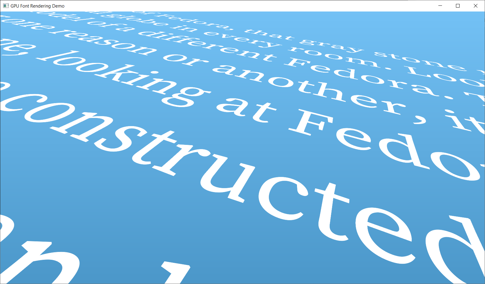
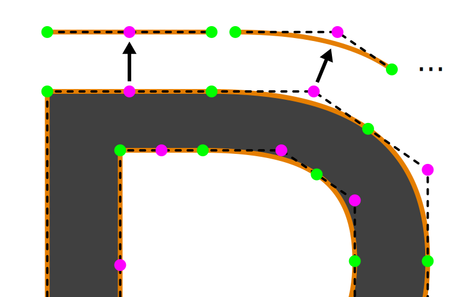
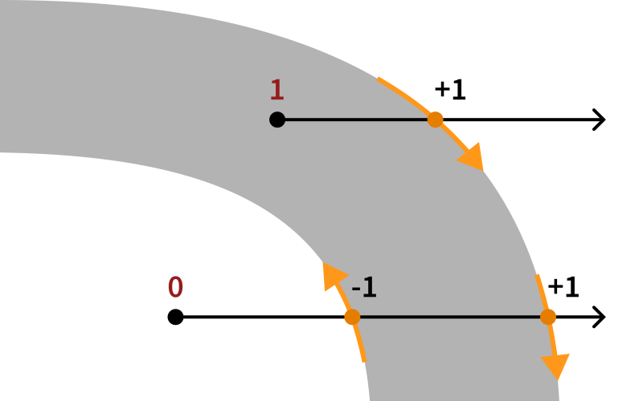
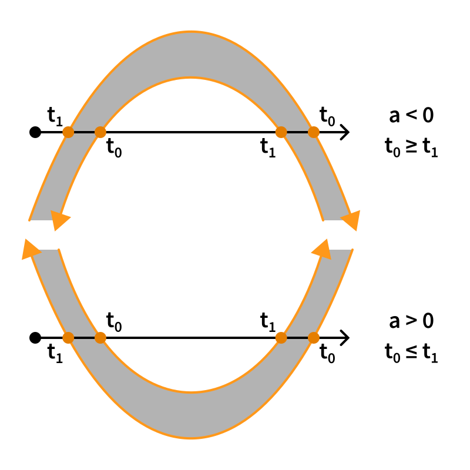

# GPU Font Rendering

This is a demonstration of rendering text directly on the GPU using the vector outlines defined by the font.



This demo is based on the method described by Will Dobbie in [GPU text rendering with vector textures](http://wdobbie.com/post/gpu-text-rendering-with-vector-textures/)
with some modifications/simplifications based on publications from Eric Lengyel ([GPU Font Rendering: Current State of the Art](http://terathon.com/font_rendering_sota_lengyel.pdf), [Poster](https://sluglibrary.com/slug_algorithm.pdf) for the [Slug Font Rendering Library](https://sluglibrary.com/), [Slug Algorithm Paper](https://jcgt.org/published/0006/02/02/)).
Other related work includes
[Improved Alpha-Tested Magnification for Vector Textures and Special Effects](https://dl.acm.org/doi/10.1145/1281500.1281665) (signed distance fields) by Chris Green and
[Easy Scalable Text Rendering on the GPU](https://medium.com/@evanwallace/easy-scalable-text-rendering-on-the-gpu-c3f4d782c5ac) by Evan Wallace.

This technique is useful for rendering large text or rendering text with arbitrary transforms (e.g. in a 3D scene) and produces pixel-perfect and anti-aliased results.
It has a slightly higher GPU runtime cost, but does not require rasterizing glyphs on the CPU.
In contrast to signed distance fields, it preserves sharp corners at all scales.

## Method

A glyph outline is described by one or more closed contours.
A contour consists of line segments and bezier curve segments defined by a list of points.
Following the TrueType convention, outside contours are oriented in clockwise direction and inside contours are oriented in counterclockwise direction.
In other words, when following the direction of the contour, the filled area is always to the right.


The contours of a glyph are converted into a list of individual quadratic bezier curves (defined by their control points), which are uploaded to the GPU.



A quad is generated for each glyph and the pixel shader determines whether each pixel is inside or outside the glyph.
To do this, the winding number of the pixel is calculated by intersecting a ray with the bezier curves.
At every intersection the ray either enters or exits the filled area as determined by the direction of the bezier curve relative to the ray.
At every exit the winding number is increased by one and at every entry the winding number is decreased by one.
After considering all intersections, the winding number will be non-zero if the pixel is inside the outline.



The direction of the rays does not matter for this winding number computation,
but the math can be greatly simplified by using rays parallel to the x-axis.
By subtracting the sample position from the control points of the bezier curves,
the coordinate system is shifted so that the origin of the ray is at $(0, 0)$ and the ray coincides with the positive x-axis.
For an intersection between the ray and a bezier curve the conditions $y = 0$ and $x >= 0$ must then be true.
Anti-aliasing (see below) will happen along the direction of the rays,
but other directions can be achieved by first rotating the control points of the bezier curves around the origin so that the rays align with the x-axis again.

To find the intersections between a ray and a single bezier curve, recall that a quadratic bezier curve is described by the following formula
(for background on bezier curves see [Beauty](https://youtu.be/aVwxzDHniEw) and [Primer](https://pomax.github.io/bezierinfo/)):

$$ \textbf{C}(t) = (1-t)^2 \textbf{P}_0 + 2(1-t)t \textbf{P}_1 + t^2 \textbf{P}_2 $$

Taking only the y-component and applying the condition $y = 0$ results in a simple quadratic equation:

$$ (1-t)^2 \textrm{y}_0 + 2(1-t)t \textrm{y}_1 + t^2 \textrm{y}_2 = 0 $$

Which can be rearranged into:

$$ \textrm{y}_0 -2t \textrm{y}_0 + t^2 \textrm{y}_0 + 2t \textrm{y}_1 - 2t^2 \textrm{y}_1 + t^2 \textrm{y}_2 = 0 $$

$$ (\textrm{y}_0 - 2\textrm{y}_1 + \textrm{y}_2) t^2 - 2(\textrm{y}_0 - \textrm{y}_1) t + \textrm{y}_0 = 0 $$

So that it can be solved using the [quadratic formula](https://en.wikipedia.org/wiki/Quadratic_formula):

$$ t_{0/1} = {-B \pm \sqrt{B^2-4ac} \over 2a} $$

$$ a = \textrm{y}_0 - 2\textrm{y}_1 + \textrm{y}_2 \quad B = -2(\textrm{y}_0 - \textrm{y}_1) \quad c = \textrm{y}_0 $$

Substituting $B = -2b$ yields:

$$ t_{0/1} = {-(-2b) \pm \sqrt{(-2b)^2-4ac} \over 2a} = {2b \pm \sqrt{4b^2-4ac} \over 2a} = {b \pm \sqrt{b^2-ac} \over a} $$

$$ a = \textrm{y}_0 - 2\textrm{y}_1 + \textrm{y}_2 \quad b = \textrm{y}_0 - \textrm{y}_1 \quad c = \textrm{y}_0 $$

The quadratic equation may have zero, one or two solutions.
Furthermore, a solution $t$ has to satisfy $0 \le t < 1$ to be on the segment described by the control points
(the end point is excluded since it is part of the next segment of the outline).
Finally, given a solution $t$ the corresponding x-coordinate can be calculated as $\mathbf{C}_x(t)$ to check the second condition $x >= 0$ for an intersection.

At this point, the intersections between the ray and bezier curve have been identified,
but they still need to be classified as entry or exit.
The demo provided by Dobbie explicitly calculates the derivative of the bezier curve for each $t$ value to do this.
However, the derivative can also be computed in general for both potential solutions $t_0/t_1$:

$$ \mathbf{C}_y(t) = (\textrm{y}_0 - 2\textrm{y}_1 + \textrm{y}_2) t^2 - 2(\textrm{y}_0 - \textrm{y}_1) t + \textrm{y}_0 $$

$$ \mathbf{C}_y(t) = a t^2 - 2b t + c $$

$$ \frac{d\mathbf{C}_y(t)}{dt} = 2at - 2b $$

$$ \frac{d\mathbf{C}_y(t_0)}{dt} = 2a{b - \sqrt{b^2-ac} \over a} - 2b = 2b - 2\sqrt{b^2-ac} - 2b = -2\sqrt{b^2-ac} \le 0 $$

$$ \frac{d\mathbf{C}_y(t_1)}{dt} = 2a{b + \sqrt{b^2-ac} \over a} - 2b = 2b + 2\sqrt{b^2-ac} - 2b = 2\sqrt{b^2-ac} \ge 0 $$

Therefore, the bezier curve crosses the x-axis in a fixed direction at each solution,
and, combined with the convention for the orientation of the contour,
$t_0$ is always an exit and $t_1$ is always an entry.

A different approach to understanding this relationship is to notice that,
because of the different signs used in the solutions and the square root being non-negative,
$t_0$ has to come first along the curve $(t_0 <= t_1)$ if $a > 0$.
Conversely, if $a < 0$, then the order is reversed and $t_1$ has to come first $(t_1 <= t_0)$.
The parameter $a$ can be rewritten as $2(\frac{\textrm{y}_0 + \textrm{y}_2}{2} - \textrm{y}_1)$,
so its sign depends on whether the second control point is above or below the midpoint of the first and third control point.
The following figure shows that the solutions are always correctly classified for all combinations of the direction of the curve and the sign of parameter $a$.
Notice how the order of the solutions along the curve changes, but the ray always enters at a $t_1$ solution and exits at a $t_0$ solution.



If the parameter $a$ is 0 (or sufficiently small in floating-point calculations), there is a linear relationship between $t$ and $y$
(this is true for linear segments, but also for some non-linear curves; see figure below),
and the quadratic formula can no longer be used because of the division by $a$.
However, because the relationship is now linear, there can be at most one solution, which is easily computed and classified.

Anti-aliasing along the ray direction is implemented by considering a window the size of a pixel around the ray origin.
If an intersection falls into this window, then the winding number is changed only fractionally to compute the coverage of the pixel.
(Note, that we have to also consider intersections slightly behind the ray origin now,
but the implementation first calculates any intersection with the x-axis and then verifies the x-position,
so it does not change much.)
For full anti-aliasing we can use multiple rays along different directions (e.g. one along the x-axis and one along the y-axis).

## Build Instructions

#### 1. Init submodules

Clone the project recursively to initialize the submodules for the dependencies
(or run `git submodule update --init` if you have already cloned the repo):

```
git clone --recursive https://github.com/GreenLightning/gpu-font-rendering.git
cd gpu-font-rendering
```

#### 2. Use CMake

```
# Note: CMake will create the build directory.
cmake -S . -B build
make -j8 --directory build
```

On Windows you might want to use CMake GUI and/or Visual Studio instead.

#### 3. Run from the main project directory

```
./build/main
```

The program requires the `fonts` and `shaders` directories to be in
the current directory to load its resources.
**If you only get a black window**, this is most likely the issue.
Check your working directory and check the console for errors.

*Tested on Windows 10 and MacOS Monterey.*
